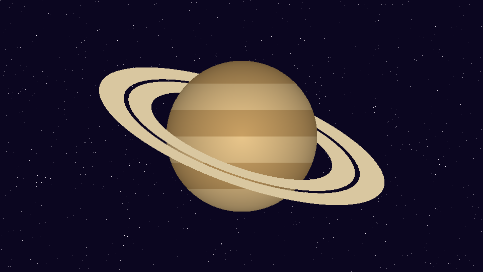

Preguntas de La Gran Trivia, en orden; el texto antes de la primera pregunta
se ignora. Cada `#` empieza una pregunta y cada elemento de la lista es una
respuesta; `[x]` marca las correctas (varias la vuelven de selección
múltiple) y sin ninguna es una encuesta. Las líneas `clave: valor` ajustan
`tiempo`, `puntos`, `modo`, `imagen`, `acierta` (la parte del ensayo que
acierta) y `votos` (los pesos del ensayo en una encuesta). Las imágenes las
dibuja `herramientas/generar_imagenes.py`.

`main.py` diseña cada diapositiva según el tipo de pregunta; para cambiar la
trivia basta con editar este archivo.

# ¿Qué tema dominas más?
modo: varias
votos: 4, 3, 2, 3
notas: Rompehielo: se puede marcar más de una.

- Ciencia
- Historia
- Arte
- Geografía

# ¿Cuál es el planeta más caliente del sistema solar?
tiempo: 20
acierta: 40%
notas: Venus: su atmósfera de CO₂ atrapa el calor (unos 460 °C), aunque Mercurio esté más cerca del Sol.

- Mercurio
- [x] Venus
- Marte
- Júpiter

# ¿Quién pintó «La noche estrellada»?
tiempo: 15
acierta: 80%

- [x] Vincent van Gogh
- Claude Monet
- Pablo Picasso
- Salvador Dalí

# ¿De qué país es esta bandera?

tiempo: 20
acierta: 45%
notas: Japón tiene el círculo centrado sobre blanco; Palaos, amarillo sobre azul.

- Japón
- [x] Bangladés
- Palaos
- Laos

# ¿Quiénes dejaron la universidad y fundaron una empresa?
tiempo: 25
acierta: 35%
notas: Gates y Zuckerberg dejaron Harvard; Jobs, el Reed College. Bezos se graduó en Princeton.

- [x] Bill Gates
- [x] Mark Zuckerberg
- Jeff Bezos
- [x] Steve Jobs

# ¿Qué planeta es este?

tiempo: 15
acierta: 85%

- Júpiter
- [x] Saturno
- Urano
- Neptuno

# ¿Cuál es el edificio más alto del mundo?
tiempo: 20
acierta: 55%
notas: El Burj Khalifa (Dubái, 2010) mide 828 m. Después viene la carrera de los récords.

- [x] Burj Khalifa
- Torre de Shanghái
- Taipei 101
- Torres Petronas

# ¿Qué elemento químico tiene el símbolo Au?
tiempo: 15
acierta: 65%

- Plata
- [x] Oro
- Argón
- Aluminio

# ¿En qué año llegó el ser humano a la Luna?
tiempo: 20
acierta: 60%

- 1965
- [x] 1969
- 1972
- 1959

# ¿Qué significa PDF?
tiempo: 20
acierta: 50%

- [x] Portable Document Format
- Printed Data File
- Public Digital Form
- Por Favor Descárgalo

# ¿Cuántos huesos tiene un adulto?
tiempo: 20
acierta: 45%

- 186
- [x] 206
- 226
- 306
