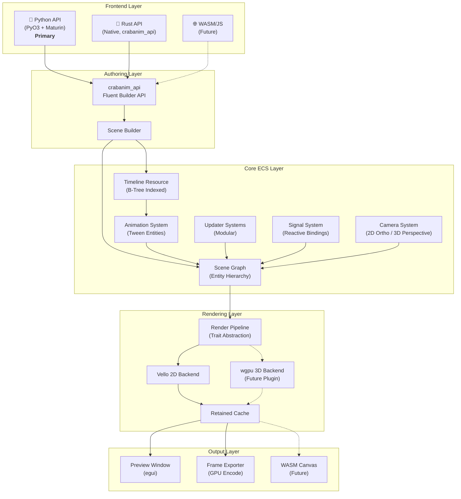
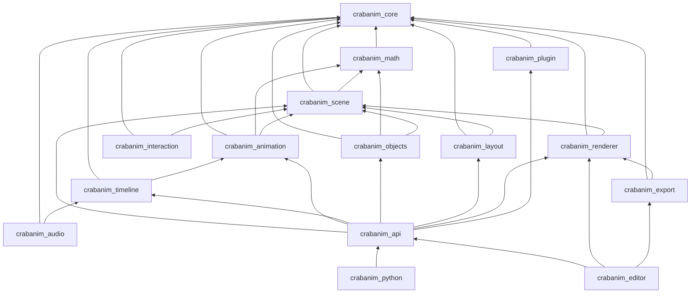
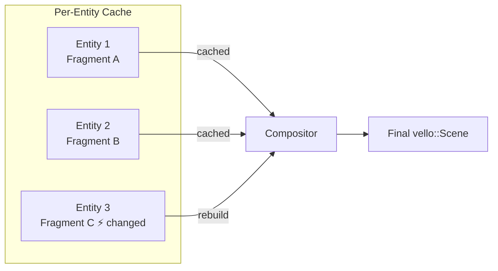
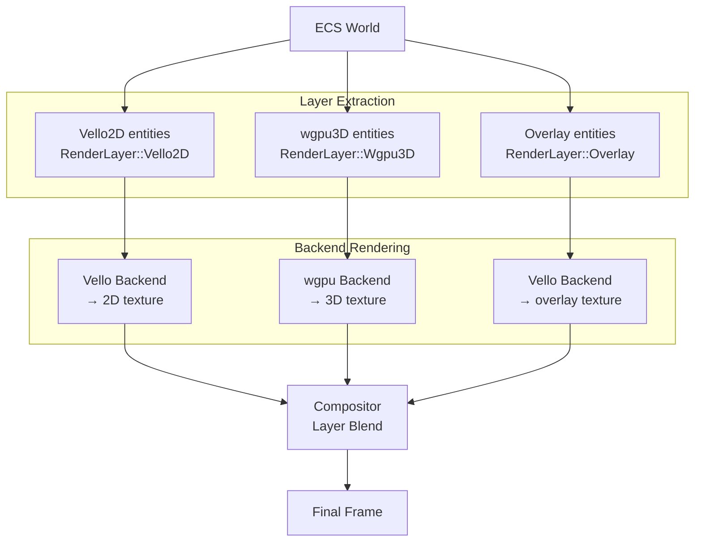

# CrabAnim v2 — Reescritura Total con Arquitectura ECS Innovadora

## Contexto

CrabAnim v1 es un motor de animación 2D programática al estilo Manim, construido sobre Bevy + Vello con scripting Python via PyO3. La versión actual tiene ~450K bytes de código Rust distribuidos en 3 crates (`engine`, `scripting`, `ui`) con un `Scene` monolítico de ~1800 líneas, `systems.rs` de ~1900 líneas, y `renderer.rs` de ~1300 líneas.

### Problemas Arquitectónicos de v1

| Problema | Impacto |
|----------|---------|
| `Scene` es un god-object (~62KB) que mezcla timeline, playback, snapshot, rendering, interacción y cámara | Difícil de extender y testear |
| `systems.rs` monolítico (~71KB) con scratch resources y caches manuales | No escalable, difícil de paralelizar |
| Timeline usa `Vec<TimelineEvent>` lineal — O(n) por seek | Lento con muchos clips |
| Snapshot/seek requiere restaurar todo el World | Costoso, no incremental |
| Renderer hace extraction + composition en un solo paso | No aprovecha retain/diff de Vello |
| Python scripting es tight-coupled al engine vía `MobjectHandle` | Imposible tener otros frontends |
| No hay sistema de plugins formal | Los usuarios no pueden extender |
| Componentes como `FillStyle`, `StrokeStyle` usan tipos propios en lugar de `peniko` directamente | Doble conversión innecesaria |
| Transforms solo 2D con scale uniforme | Imposible agregar 3D sin reescribir |

---

## Decisiones de Diseño (Confirmadas)

| Decisión | Resolución | Impacto |
|----------|------------|---------|
| **Lenguaje de scripting** | ✅ **Python** como lenguaje principal (PyO3 + Maturin) | La Python API se rediseña como capa thin sobre la Rust API nativa |
| **Compatibilidad v1** | ✅ **Romper** compatibilidad total | API nueva desde cero, sin capa legacy. Priorizar performance y arquitectura limpia |
| **3D** | ✅ **Fundaciones 3D** desde el inicio | Tipos de transform, camera y render pipeline preparados para 3D sin refactors futuros |
| **Bevy** | ✅ Target **0.18**, diseñar para migrar a **0.19** | Abstracciones sobre features que cambiarán (Relations, Required Components) |
| **Editor** | ✅ **egui** se mantiene, migración a Bevy UI es un "nice to have" futuro | Separar lógica de editor del framework UI |
| **WASM** | ✅ **Objetivo futuro**, no day-1 | Evitar dependencias incompatibles, pero no over-engineer para WASM aún |

---

## Arquitectura Propuesta: "3D-Ready Reactive Scene Graph"

### Filosofía de Diseño

```
┌──────────────────────────────────────────────────────────────┐
│                   CrabAnim v2 Core Principles                │
├──────────────────────────────────────────────────────────────┤
│ 1. Everything is an Entity                                   │
│ 2. Properties are Components (peniko/kurbo types directly)   │
│ 3. Animations are Entities with Tween Components             │
│ 4. Timeline is a Resource with B-Tree indexed clips          │
│ 5. Rendering is a pure extraction from ECS World             │
│ 6. Python is a thin adapter over Rust-native API             │
│ 7. Plugins are Bevy Plugins                                  │
│ 8. Every system is independently testable                    │
│ 9. Spatial types are dimension-agnostic (2D/3D ready)        │
│ 10. Abstractions anticipate Bevy 0.19 migration              │
└──────────────────────────────────────────────────────────────┘
```

### Diagrama de Arquitectura de Alto Nivel



---

## Proposed Changes

### Workspace Structure

```
crabanim/
├── Cargo.toml                    # Workspace root
├── crates/
│   ├── crabanim_core/            # [NEW] Core types, traits, error handling
│   ├── crabanim_math/            # [NEW] Geometry, easing, interpolation, spatial types
│   ├── crabanim_scene/           # [NEW] Scene graph, components, hierarchy
│   ├── crabanim_animation/       # [NEW] Tween system, keyframes, signals
│   ├── crabanim_timeline/        # [NEW] Event-sourced timeline, seek, snapshot
│   ├── crabanim_renderer/        # [NEW] Vello extraction, retained cache, effects
│   ├── crabanim_objects/         # [NEW] Mobject library (primitives, math, text)
│   ├── crabanim_export/          # [NEW] Video/image export pipeline
│   ├── crabanim_audio/           # [NEW] Audio tracks, sync, waveform
│   ├── crabanim_interaction/     # [NEW] Pointer events, hit testing
│   ├── crabanim_layout/          # [NEW] Positioning, anchors, flexbox
│   ├── crabanim_api/             # [NEW] Fluent Rust API / Scene builder
│   ├── crabanim_python/          # [REWRITE] Python bindings (thin layer over crabanim_api)
│   ├── crabanim_editor/          # [REWRITE] Editor UI (egui, decoupled from framework)
│   └── crabanim_plugin/          # [NEW] Plugin SDK + registry
├── plugins/                      # [NEW] Official plugins (workspace members)
│   ├── crabanim_3d/              # 3D rendering plugin (wgpu pipeline)
│   ├── crabanim_code/            # Code syntax highlighting mobject
│   └── crabanim_graph/           # Graph theory visualization
├── examples/
├── python/                       # Python package (crabanim)
├── docs/
└── tests/
```

### Dependency Graph entre Crates



---

### 1. `crabanim_core` — Tipos Fundamentales

#### [NEW] core/lib.rs

Tipos compartidos entre todos los crates. **Sin wrappers** — re-export directo de peniko/kurbo:

```rust
// Re-exportar directamente — NO crear wrappers
pub use peniko::{Color, Brush, Fill, Gradient, BlendMode};
pub use kurbo::{Affine, BezPath, Point, Vec2, Rect, Size, Shape};
pub use glam;  // para tipos 3D (Vec3, Mat4, Quat)

/// Identificador único de objetos en la escena
#[derive(Component, Debug, Clone, Copy, PartialEq, Eq, Hash)]
pub struct ObjectId(pub Entity);

/// Duración en el timeline
#[derive(Debug, Clone, Copy)]
pub struct TimeSpan { pub start: f64, pub duration: f64 }

/// Error type unificado
#[derive(Debug, thiserror::Error)]
pub enum CrabAnimError {
    #[error("entity not found: {0:?}")]
    EntityNotFound(Entity),
    #[error("animation error: {0}")]
    Animation(String),
    #[error("render error: {0}")]
    Render(String),
    #[error("export error: {0}")]
    Export(String),
    #[error("typst error: {0}")]
    Typst(String),
    #[error("io error: {0}")]
    Io(#[from] std::io::Error),
}

pub type Result<T> = std::result::Result<T, CrabAnimError>;
```

**Decisión clave:** Usar `peniko::Color` y `kurbo::BezPath` directamente en componentes. Esto elimina las ~200 conversiones `.to_peniko()` que v1 tiene por todo el renderer y animation system. Re-exportar `glam` para los tipos 3D que necesitan las foundations.

---

### 2. `crabanim_math` — Geometría y Tipos Espaciales (3D-Ready)

#### [NEW] math/spatial.rs

> [!IMPORTANT]
> **Fundación 3D:** El sistema de transforms es genérico sobre dimensionalidad. En v2 se usa `SpatialTransform` que puede ser 2D o 3D sin cambiar la API del scene graph ni las animaciones.

```rust
/// Transform espacial unificado — puede representar 2D y 3D
///
/// En modo 2D: z=0, rotation usa solo el eje Z
/// En modo 3D: todos los ejes activos
#[derive(Component, Debug, Clone, Copy)]
pub struct SpatialTransform {
    pub translation: glam::DVec3,    // (x, y, z) — z=0 para 2D
    pub rotation: glam::DQuat,      // quaternion — identidad para 2D puro
    pub scale: glam::DVec3,         // non-uniform scale en 3 ejes
    pub anchor: glam::DVec3,        // pivot point (local space)
}

impl SpatialTransform {
    /// Constructor 2D convenience
    pub fn new_2d(x: f64, y: f64) -> Self {
        Self {
            translation: glam::DVec3::new(x, y, 0.0),
            rotation: glam::DQuat::IDENTITY,
            scale: glam::DVec3::ONE,
            anchor: glam::DVec3::ZERO,
        }
    }

    /// Constructor 3D
    pub fn new_3d(x: f64, y: f64, z: f64) -> Self {
        Self {
            translation: glam::DVec3::new(x, y, z),
            rotation: glam::DQuat::IDENTITY,
            scale: glam::DVec3::ONE,
            anchor: glam::DVec3::ZERO,
        }
    }

    /// Setear rotación 2D (solo Z axis)
    pub fn with_rotation_2d(mut self, radians: f64) -> Self {
        self.rotation = glam::DQuat::from_rotation_z(radians);
        self
    }

    /// Setear rotación 3D (Euler angles)
    pub fn with_rotation_euler(mut self, pitch: f64, yaw: f64, roll: f64) -> Self {
        self.rotation = glam::DQuat::from_euler(glam::EulerRot::XYZ, pitch, yaw, roll);
        self
    }

    /// Compute affine 2D (para Vello rendering — projección ortográfica)
    pub fn to_affine_2d(&self) -> kurbo::Affine {
        let (_, _, z_angle) = self.rotation.to_euler(glam::EulerRot::XYZ);
        kurbo::Affine::translate((self.translation.x, self.translation.y))
            * kurbo::Affine::rotate(z_angle)
            * kurbo::Affine::scale_non_uniform(self.scale.x, self.scale.y)
    }

    /// Compute 4x4 matrix (para futuro 3D pipeline)
    pub fn to_mat4(&self) -> glam::DMat4 {
        glam::DMat4::from_scale_rotation_translation(
            self.scale,
            self.rotation,
            self.translation,
        )
    }
}

/// Global transform computado — almacena tanto Affine 2D como Mat4
#[derive(Component, Debug, Clone, Copy)]
pub struct GlobalSpatialTransform {
    /// Affine 2D para Vello rendering (siempre actualizado)
    pub affine_2d: kurbo::Affine,
    /// Mat4 para 3D pipeline (solo cuando feature "3d" está activo)
    pub mat4: glam::DMat4,
}

impl GlobalSpatialTransform {
    pub fn from_local(local: &SpatialTransform) -> Self {
        Self {
            affine_2d: local.to_affine_2d(),
            mat4: local.to_mat4(),
        }
    }

    pub fn from_parent_and_local(parent: &Self, local: &SpatialTransform) -> Self {
        Self {
            affine_2d: parent.affine_2d * local.to_affine_2d(),
            mat4: parent.mat4 * local.to_mat4(),
        }
    }
}
```

#### [NEW] math/bounds.rs

```rust
/// Axis-Aligned Bounding Box — 3D ready
#[derive(Debug, Clone, Copy, Default)]
pub struct Bounds3D {
    pub min: glam::DVec3,
    pub max: glam::DVec3,
}

impl Bounds3D {
    /// Crear AABB 2D (z min/max = 0)
    pub fn new_2d(min_x: f64, min_y: f64, max_x: f64, max_y: f64) -> Self {
        Self {
            min: glam::DVec3::new(min_x, min_y, 0.0),
            max: glam::DVec3::new(max_x, max_y, 0.0),
        }
    }

    pub fn center(&self) -> glam::DVec3 { (self.min + self.max) * 0.5 }
    pub fn size(&self) -> glam::DVec3 { self.max - self.min }
    pub fn width(&self) -> f64 { self.max.x - self.min.x }
    pub fn height(&self) -> f64 { self.max.y - self.min.y }
    pub fn depth(&self) -> f64 { self.max.z - self.min.z }

    pub fn union(&self, other: &Self) -> Self {
        Self {
            min: self.min.min(other.min),
            max: self.max.max(other.max),
        }
    }

    pub fn intersects(&self, other: &Self) -> bool {
        self.min.x <= other.max.x && self.max.x >= other.min.x
        && self.min.y <= other.max.y && self.max.y >= other.min.y
        && self.min.z <= other.max.z && self.max.z >= other.min.z
    }

    /// Project to 2D kurbo::Rect (for Vello)
    pub fn to_rect_2d(&self) -> kurbo::Rect {
        kurbo::Rect::new(self.min.x, self.min.y, self.max.x, self.max.y)
    }
}
```

#### [NEW] math/camera.rs

> [!IMPORTANT]
> **Fundación 3D:** La Camera es un trait con dos implementaciones (2D ortográfica y 3D perspectiva). Todos los sistemas usan el trait, permitiendo agregar 3D como plugin sin tocar el core.

```rust
/// Proyección de cámara — enum extensible
#[derive(Debug, Clone, Copy)]
pub enum Projection {
    /// Ortográfica 2D (actual CrabAnim)
    Orthographic {
        zoom: f64,
        // width/height vienen del viewport
    },
    /// Perspectiva 3D (futuro plugin)
    Perspective {
        fov_y: f64,           // field of view vertical (radians)
        near: f64,
        far: f64,
    },
}

/// Camera unificada
#[derive(Resource, Debug, Clone)]
pub struct Camera {
    /// Posición en el mundo (3D-ready)
    pub position: glam::DVec3,
    /// Rotación (quaternion para 3D, solo Z para 2D)
    pub rotation: glam::DQuat,
    /// Tipo de proyección
    pub projection: Projection,
    /// Dimensiones del viewport en pixels
    pub viewport_width: u32,
    pub viewport_height: u32,
}

impl Camera {
    /// Constructor 2D (lo que v1 tiene)
    pub fn ortho_2d(width: u32, height: u32) -> Self {
        Self {
            position: glam::DVec3::ZERO,
            rotation: glam::DQuat::IDENTITY,
            projection: Projection::Orthographic { zoom: 1.0 },
            viewport_width: width,
            viewport_height: height,
        }
    }

    /// Constructor 3D (futuro)
    pub fn perspective_3d(width: u32, height: u32, fov: f64) -> Self {
        Self {
            position: glam::DVec3::new(0.0, 0.0, 10.0),
            rotation: glam::DQuat::IDENTITY,
            projection: Projection::Perspective {
                fov_y: fov,
                near: 0.1,
                far: 1000.0,
            },
            viewport_width: width,
            viewport_height: height,
        }
    }

    /// View matrix (para ambos pipelines)
    pub fn view_matrix(&self) -> glam::DMat4 {
        glam::DMat4::from_rotation_translation(self.rotation, self.position).inverse()
    }

    /// Projection matrix
    pub fn projection_matrix(&self) -> glam::DMat4 {
        match self.projection {
            Projection::Orthographic { zoom } => {
                let hw = (self.viewport_width as f64) / (2.0 * zoom);
                let hh = (self.viewport_height as f64) / (2.0 * zoom);
                glam::DMat4::orthographic_rh(-hw, hw, -hh, hh, -1000.0, 1000.0)
            }
            Projection::Perspective { fov_y, near, far } => {
                let aspect = self.viewport_width as f64 / self.viewport_height as f64;
                glam::DMat4::perspective_rh(fov_y, aspect, near, far)
            }
        }
    }

    /// Affine 2D para Vello (solo modo ortográfico)
    pub fn to_vello_transform(&self) -> kurbo::Affine {
        let zoom = match self.projection {
            Projection::Orthographic { zoom } => zoom,
            _ => 1.0,
        };
        let (_, _, z_angle) = self.rotation.to_euler(glam::EulerRot::XYZ);
        let hw = self.viewport_width as f64 / 2.0;
        let hh = self.viewport_height as f64 / 2.0;

        kurbo::Affine::translate((hw, hh))
            * kurbo::Affine::rotate(-z_angle)
            * kurbo::Affine::scale(zoom)
            * kurbo::Affine::translate((-self.position.x, -self.position.y))
    }

    /// World ↔ Screen conversions
    pub fn world_to_screen(&self, world: glam::DVec3) -> glam::DVec2 { /* ... */ }
    pub fn screen_to_world(&self, screen: glam::DVec2) -> glam::DVec3 { /* ... */ }
}
```

---

### 3. `crabanim_scene` — Scene Graph ECS

#### [NEW] scene/components.rs

Componentes rediseñados con tipos 3D-ready:

```rust
// === Re-exports de crabanim_math ===
pub use crabanim_math::{SpatialTransform, GlobalSpatialTransform, Bounds3D, Camera};

/// Fill — directamente peniko::Brush
#[derive(Component, Debug, Clone)]
pub struct FillBrush(pub Option<Brush>);

/// Stroke — directamente peniko::Stroke + Brush
#[derive(Component, Debug, Clone)]
pub struct StrokeBrush {
    pub brush: Option<Brush>,
    pub style: kurbo::Stroke,
}

/// Opacidad local
#[derive(Component, Debug, Clone, Copy)]
pub struct Opacity(pub f32);

/// Opacidad global (propagada por hierarchy system)
#[derive(Component, Debug, Clone, Copy)]
pub struct GlobalOpacity(pub f32);

/// Geometría 2D — directamente kurbo::BezPath
#[derive(Component, Debug, Clone)]
pub struct Path2D(pub BezPath);

/// Geometría 3D (futuro) — mesh data
#[derive(Component, Debug, Clone)]
pub struct Mesh3D {
    pub vertices: Vec<glam::Vec3>,
    pub indices: Vec<u32>,
    pub normals: Option<Vec<glam::Vec3>>,
    pub uvs: Option<Vec<glam::Vec2>>,
}

/// Local bounds (computado automáticamente)
#[derive(Component, Debug, Clone, Copy)]
pub struct LocalBounds(pub Bounds3D);

/// World bounds (computado por propagation system)
#[derive(Component, Debug, Clone, Copy)]
pub struct WorldBounds(pub Bounds3D);

/// Z-Order con creation order como tiebreaker (resuelve bug de v1)
#[derive(Component, Debug, Clone, Copy)]
pub struct RenderOrder {
    pub z_index: i32,
    pub creation_order: u64,   // monotonically increasing counter
}

/// Marker: entidad visible en la escena
#[derive(Component, Debug, Clone, Copy, Default)]
pub struct Visible;

/// Marker: entidad es un grupo/container
#[derive(Component, Debug, Clone, Copy, Default)]
pub struct GroupMarker;

/// Tag for object type identification
#[derive(Component, Debug, Clone)]
pub struct ObjectTag(pub String);

/// Render layer — qué pipeline debe renderizar esta entidad
#[derive(Component, Debug, Clone, Copy, PartialEq, Eq)]
pub enum RenderLayer {
    /// 2D Vello pipeline (default)
    Vello2D,
    /// 3D wgpu pipeline (futuro plugin)
    Wgpu3D,
    /// Overlay (always on top, screen-space)
    Overlay,
}

impl Default for RenderLayer {
    fn default() -> Self { Self::Vello2D }
}
```

#### [NEW] scene/hierarchy.rs

System Sets para orden de ejecución determinístico:

```rust
/// System Set — orden de ejecución global
///
/// Diseñado para anticipar Bevy 0.19 donde los system sets
/// pueden cambiar. Toda la lógica de ordering está centralizada aquí.
#[derive(SystemSet, Debug, Clone, PartialEq, Eq, Hash)]
pub enum SceneSet {
    /// Phase 1: External mutations (scripting, input)
    Input,
    /// Phase 2: Animation tween evaluation
    Animation,
    /// Phase 3: Updaters (bob, rotate, follow, signals, etc.)
    Updaters,
    /// Phase 4: Layout constraints (pin, anchor, flex)
    Layout,
    /// Phase 5: Hierarchy propagation (transform, opacity)
    Propagation,
    /// Phase 6: Bounds computation
    Bounds,
    /// Phase 7: Render extraction
    Extraction,
    /// Phase 8: Interaction processing (hit testing)
    Interaction,
}
```

> [!NOTE]
> **Bevy 0.19 prep:** El `SceneSet` enum es el único lugar donde el ordering está definido. Cuando Bevy 0.19 cambie la API de system sets, solo hay que actualizar este módulo. Los crates individuales importan `SceneSet` sin asumir nada sobre la implementación.

---

### 4. `crabanim_animation` — Sistema de Animación Reactivo

#### [NEW] animation/tween.rs

Tweens como entidades completas en el ECS:

```rust
/// Un tween es una entidad con estos componentes.
/// Ventaja: processable en paralelo, inspectable, serializeable.
#[derive(Component, Debug, Clone)]
pub struct Tween {
    pub target: Entity,          // entidad a animar
    pub delay: f64,              // delay antes de empezar
    pub duration: f64,           // duración total
    pub elapsed: f64,            // tiempo transcurrido
    pub rate_func: RateFunc,     // easing function
    pub state: TweenState,
}

#[derive(Debug, Clone, Copy, PartialEq, Eq)]
pub enum TweenState {
    Pending,    // esperando delay
    Active,     // interpolando
    Completed,  // terminó
}

/// Qué propiedad animar — Component enum discriminado
#[derive(Component, Debug, Clone)]
pub enum PropertyLens {
    // === Spatial (3D-ready) ===
    Translation { from: glam::DVec3, to: glam::DVec3 },
    Rotation { from: glam::DQuat, to: glam::DQuat },
    Scale { from: glam::DVec3, to: glam::DVec3 },

    // === Visual ===
    Opacity { from: f32, to: f32 },
    FillColor { from: Color, to: Color },
    StrokeColor { from: Color, to: Color },
    StrokeWidth { from: f64, to: f64 },

    // === Path ===
    PathMorph { from: BezPath, to: BezPath, table: MorphTable },
    PathCompletion { from: f64, to: f64 },

    // === Camera (3D-ready) ===
    CameraPosition { from: glam::DVec3, to: glam::DVec3 },
    CameraRotation { from: glam::DQuat, to: glam::DQuat },
    CameraZoom { from: f64, to: f64 },

    // === Extensible ===
    Custom(Box<dyn AnimatableLens>),
}

/// Trait para lenses custom — plugins can add new animatable properties
pub trait AnimatableLens: Send + Sync + 'static {
    fn interpolate(&self, world: &mut World, entity: Entity, t: f64);
    fn clone_box(&self) -> Box<dyn AnimatableLens>;
    fn type_name(&self) -> &'static str;
}
```

**Innovación vs v1:**
- Los tweens son entidades independientes, no embedded en el Scene
- `PropertyLens` usa `glam::DVec3` / `DQuat` — interpolación es correcta en 3D sin cambios
- `Custom(Box<dyn AnimatableLens>)` permite plugins que animan propiedades custom
- Cada tipo de lens puede tener su propio sistema paralelo (lens pipeline)

#### [NEW] animation/signals.rs

Sistema de señales reactivas (inspirado en Motion Canvas):

```rust
/// Signal value — un valor observable que dispara re-evaluación
#[derive(Component, Debug, Clone)]
pub struct Signal<T: Send + Sync + Clone + 'static> {
    pub value: T,
}

/// Binding: cuando Signal<T> cambia, recalcular
#[derive(Component)]
pub struct SignalBinding {
    pub source: Entity,
    pub apply: Box<dyn Fn(&World, Entity, &mut Commands) + Send + Sync>,
}

/// always_redraw: rebuilds mobject cada frame cuando sus signals cambian
#[derive(Component)]
pub struct AlwaysRedraw {
    pub signals: Vec<Entity>,
    pub builder: Box<dyn Fn(&World) -> MobjectSpec + Send + Sync>,
}

/// Python-friendly: MobjectSpec es una descripción serializable de un mobject
#[derive(Debug, Clone)]
pub struct MobjectSpec {
    pub kind: String,         // "circle", "rectangle", etc.
    pub params: ParamMap,     // HashMap<String, Value>
}
```

#### [NEW] animation/easing.rs

Rate functions completas con soporte para curvas custom:

```rust
#[derive(Debug, Clone)]
pub enum RateFunc {
    Linear,
    Smooth,
    DoubleSmooth,
    EaseInOut(EasingCurve),
    EaseIn(EasingCurve),
    EaseOut(EasingCurve),
    Spring { stiffness: f64, damping: f64 },
    Steps(u32),
    Mirror(Box<RateFunc>),
    ThereAndBack,
    ThereAndBackWithPause(f64),
    Lingering,
    RunningStart,
    CubicBezier(f64, f64, f64, f64),   // CSS-style cubic-bezier
    Custom(Arc<dyn Fn(f64) -> f64 + Send + Sync>),
}

#[derive(Debug, Clone, Copy)]
pub enum EasingCurve {
    Quad, Cubic, Quart, Quint, Expo, Sine,
    Circ, Back, Elastic, Bounce,
}
```

---

### 5. `crabanim_timeline` — Timeline Event-Sourced con B-Tree

#### [NEW] timeline/mod.rs

Rediseño completo para O(log n) seek:

```rust
/// Timeline principal — indexación temporal via BTreeMap
pub struct Timeline {
    /// Tracks organizados por nombre
    tracks: Vec<Track>,
    /// Clips indexados por tiempo de inicio: O(log n) lookup
    clip_index: BTreeMap<OrderedFloat<f64>, Vec<ClipId>>,
    /// Clips almacenados por ID — generational arena, no invalidation
    clips: SlotMap<ClipId, Clip>,
    /// Keyframes para seek rápido
    keyframes: BTreeMap<OrderedFloat<f64>, WorldSnapshot>,
    /// Eventos de scene (add/remove/property)
    event_log: Vec<TimelineEvent>,
    /// Duration cache
    cached_duration: f64,
}

/// Un clip individual
pub struct Clip {
    pub id: ClipId,
    pub track: TrackId,
    pub start: f64,
    pub duration: f64,
    pub payload: ClipPayload,
}

/// Tipos de payload — extensible para audio y markers
pub enum ClipPayload {
    Animation(AnimationSpec),
    Wait,
    Audio { source: AudioSourceId, offset: f64 },
    Marker(String),
    Breakpoint,        // slide() para modo presentación
    SegmentStart(String),
}

/// Seek optimizado: nearest keyframe + replay
impl Timeline {
    pub fn seek_prepare(&self, target_time: f64) -> SeekPlan {
        // 1. B-Tree range query: nearest keyframe <= target_time → O(log n)
        // 2. Collect events in (keyframe_time..target_time] → O(log n + k)
        // 3. Return SeekPlan { restore_snapshot, events_to_replay }
    }

    pub fn active_clips_at(&self, time: f64) -> impl Iterator<Item = &Clip> {
        // B-Tree range query: clips where start <= time && time <= start + duration
    }
}

/// SnapshotDiff — solo guardar lo que cambió (vs v1 que guarda todo)
pub struct SnapshotDiff {
    pub changed_components: Vec<(Entity, ComponentDiff)>,
    pub added_entities: Vec<EntitySnapshot>,
    pub removed_entities: Vec<Entity>,
}
```

**Mejoras vs v1:**
- `BTreeMap<OrderedFloat<f64>, Vec<ClipId>>` → O(log n) seek vs O(n) scan
- `SlotMap<ClipId, Clip>` → acceso por ID sin invalidación
- `SnapshotDiff` → solo guarda deltas, no el World entero
- Multi-track: audio, markers y breakpoints como primera clase

---

### 6. `crabanim_renderer` — Pipeline de Rendering Abstracto

#### [NEW] renderer/pipeline.rs

> [!IMPORTANT]
> **Fundación 3D:** El renderer define un trait `RenderBackend`. El backend 2D (Vello) es el default. El futuro plugin `crabanim_3d` registra un backend wgpu para entidades con `RenderLayer::Wgpu3D`. Ambos pipelines coexisten en la misma escena.

```rust
/// Trait abstracto para backends de rendering
pub trait RenderBackend: Send + Sync + 'static {
    /// Qué layer este backend maneja
    fn layer(&self) -> RenderLayer;

    /// Extraer renderables del World para este layer
    fn extract(&mut self, world: &World, camera: &Camera) -> Vec<RenderItem>;

    /// Renderizar a pixels RGBA
    fn render(
        &mut self,
        items: &[RenderItem],
        camera: &Camera,
        width: u32,
        height: u32,
    ) -> RenderOutput;
}

/// Backend 2D: Vello (implementación default)
pub struct Vello2DBackend {
    device: wgpu::Device,
    queue: wgpu::Queue,
    renderer: vello::Renderer,
    fragment_cache: FragmentCache,
}

impl RenderBackend for Vello2DBackend {
    fn layer(&self) -> RenderLayer { RenderLayer::Vello2D }

    fn extract(&mut self, world: &World, camera: &Camera) -> Vec<RenderItem> {
        // Phase 1: Extract — query entities with RenderLayer::Vello2D
        // Only re-extract where Changed<T> detected
        // Use content signatures for fine-grained invalidation
    }

    fn render(&mut self, items: &[RenderItem], camera: &Camera, w: u32, h: u32) -> RenderOutput {
        // Phase 2: Prepare — build/update per-entity Vello Scene fragments
        // Phase 3: Compose — assemble, sort by RenderOrder, apply camera, cull
        // Phase 4: GPU dispatch via vello::Renderer
    }
}

/// Compositor que orquesta múltiples backends
pub struct RenderCompositor {
    backends: Vec<Box<dyn RenderBackend>>,
}

impl RenderCompositor {
    /// Render all layers, composite into final framebuffer
    pub fn render_frame(
        &mut self,
        world: &World,
        camera: &Camera,
        width: u32,
        height: u32,
    ) -> Vec<u8> {
        // 1. For each backend, extract + render to texture
        // 2. Composite layers (2D behind 3D, overlay on top)
        // 3. Return final RGBA pixels
    }
}
```

**Innovación vs v1:**
- v1 tiene una sola función `render_world_to_vello` de ~300 líneas
- v2 tiene 3 fases cacheable + trait para múltiples backends
- `FragmentCache` almacena `vello::Scene` fragments per-entity
- El compositor permite mezclar 2D Vello + 3D wgpu en la misma escena

#### [NEW] renderer/effects.rs

Efectos visuales como componentes (mismos que v1, pero con `GaussianBlur` y `ClipMask` nuevos):

```rust
#[derive(Component, Debug, Clone)]
pub struct DropShadow {
    pub offset: glam::DVec2,
    pub blur_radius: f64,
    pub color: Color,
}

#[derive(Component, Debug, Clone)]
pub struct Glow {
    pub radius: f64,
    pub intensity: f32,
    pub color: Color,
}

#[derive(Component, Debug, Clone)]
pub struct GaussianBlur { pub sigma: f64 }

#[derive(Component, Debug, Clone)]
pub struct ClipMask { pub path: BezPath, pub rule: Fill }
```

---

### 7. `crabanim_objects` — Biblioteca de Mobjects

#### [NEW] objects/primitives.rs

Objetos como funciones que producen bundles. Usan `SpatialTransform` (3D-ready):

```rust
/// Cada primitivo retorna un bundle con todos los componentes necesarios
pub fn circle(radius: f64) -> impl Bundle {
    (
        Path2D(kurbo::Circle::new(kurbo::Point::ZERO, radius).to_path(0.1)),
        LocalBounds(Bounds3D::new_2d(-radius, -radius, radius, radius)),
        SpatialTransform::new_2d(0.0, 0.0),
        GlobalSpatialTransform::default(),
        FillBrush(Some(Brush::Solid(Color::WHITE))),
        StrokeBrush::default(),
        Opacity(1.0),
        GlobalOpacity(1.0),
        RenderOrder::default(),
        RenderLayer::Vello2D,
        Visible,
        ObjectTag("Circle".into()),
    )
}

pub fn rectangle(width: f64, height: f64) -> impl Bundle { /* ... */ }
pub fn rounded_rect(width: f64, height: f64, radius: f64) -> impl Bundle { /* ... */ }
pub fn line(start: kurbo::Point, end: kurbo::Point) -> impl Bundle { /* ... */ }
pub fn arc(center: kurbo::Point, radii: kurbo::Vec2, start: f64, sweep: f64) -> impl Bundle { /* ... */ }
pub fn polygon(points: &[kurbo::Point]) -> impl Bundle { /* ... */ }
pub fn star(n: u32, outer_r: f64, inner_r: f64) -> impl Bundle { /* ... */ }
pub fn ellipse(rx: f64, ry: f64) -> impl Bundle { /* ... */ }
pub fn dot(radius: f64) -> impl Bundle { /* ... */ }
// ... todos los primitivos de v1
```

#### [NEW] objects/text.rs

```rust
/// Texto simple (sin math) — renderizado via cosmic-text
#[derive(Component, Debug, Clone)]
pub struct TextContent {
    pub text: String,
    pub font_family: String,
    pub font_size: f64,
    pub weight: FontWeight,
}

/// Texto matemático via Typst
#[derive(Component, Debug, Clone)]
pub struct MathContent {
    pub typst_source: String,
    pub rendered_svg: Option<SvgData>,
}

/// Raw Typst document
#[derive(Component, Debug, Clone)]
pub struct TypstDocument {
    pub source: String,
    pub rendered_svg: Option<SvgData>,
}
```

---

### 8. `crabanim_api` — Fluent Builder API (Rust-native)

#### [NEW] api/scene_builder.rs

> [!IMPORTANT]
> Esta es la API core. `crabanim_python` es un thin wrapper sobre esta API. Toda la lógica vive aquí en Rust puro.

```rust
pub struct SceneBuilder {
    app: App,
    timeline: Timeline,
    cursor: f64,
    camera: Camera,
    creation_counter: u64,
}

impl SceneBuilder {
    pub fn new() -> Self { /* ... */ }
    pub fn with_dimensions(width: u32, height: u32) -> Self { /* ... */ }

    /// Add a mobject to the scene
    pub fn add(&mut self, bundle: impl Bundle) -> MobjectHandle<'_> { /* ... */ }

    /// Play an animation (advances cursor)
    pub fn play(&mut self, animation: impl Into<AnimationSpec>) -> &mut Self { /* ... */ }

    /// Play animations in parallel (advances cursor by max duration)
    pub fn play_parallel(&mut self, anims: Vec<AnimationSpec>) -> &mut Self { /* ... */ }

    /// Wait (advances cursor)
    pub fn wait(&mut self, duration: f64) -> &mut Self { /* ... */ }

    /// Slide breakpoint for presentation mode
    pub fn slide(&mut self) -> &mut Self { /* ... */ }

    /// Set background color
    pub fn background(&mut self, color: Color) -> &mut Self { /* ... */ }

    /// Camera access
    pub fn camera_mut(&mut self) -> &mut Camera { /* ... */ }

    /// Build final scene for rendering/export
    pub fn build(self) -> BuiltScene { /* ... */ }
}

/// Handle for fluent mobject manipulation
pub struct MobjectHandle<'a> {
    entity: Entity,
    scene: &'a mut SceneBuilder,
}

impl<'a> MobjectHandle<'a> {
    pub fn entity(&self) -> Entity { self.entity }
    pub fn at(self, x: f64, y: f64) -> Self { /* set translation */ }
    pub fn at_3d(self, x: f64, y: f64, z: f64) -> Self { /* 3D translation */ }
    pub fn fill(self, color: Color) -> Self { /* ... */ }
    pub fn stroke(self, color: Color, width: f64) -> Self { /* ... */ }
    pub fn opacity(self, o: f32) -> Self { /* ... */ }
    pub fn scale(self, s: f64) -> Self { /* uniform scale */ }
    pub fn scale_xy(self, sx: f64, sy: f64) -> Self { /* non-uniform */ }
    pub fn rotate(self, radians: f64) -> Self { /* Z-axis rotation */ }
    pub fn z_index(self, z: i32) -> Self { /* ... */ }
    pub fn next_to(self, other: Entity, dir: Direction, buff: f64) -> Self { /* ... */ }

    // Animation constructors
    pub fn create(&self, duration: f64) -> AnimationSpec { /* ... */ }
    pub fn fade_in(&self, duration: f64) -> AnimationSpec { /* ... */ }
    pub fn fade_out(&self, duration: f64) -> AnimationSpec { /* ... */ }
    pub fn write(&self, duration: f64) -> AnimationSpec { /* ... */ }
    pub fn animate(&self) -> AnimateBuilder { /* ... */ }
}
```

---

### 9. `crabanim_python` — Python Bindings (Thin Layer)

#### [REWRITE] python/lib.rs

> [!IMPORTANT]
> **Romper compatibilidad con v1 deliberadamente.** La nueva Python API es más ergonómica, pero no backwards-compatible.

```rust
/// El módulo Python es un thin wrapper sobre crabanim_api
#[pymodule]
fn crabanim(m: &Bound<'_, PyModule>) -> PyResult<()> {
    m.add_class::<PyScene>()?;
    m.add_class::<PyMobject>()?;
    m.add_class::<PyAnimation>()?;
    // ... register all Python-visible types
    Ok(())
}

#[pyclass]
struct PyScene {
    inner: SceneBuilder,
}

#[pymethods]
impl PyScene {
    #[new]
    fn new(width: Option<u32>, height: Option<u32>) -> Self { /* ... */ }

    fn add(&mut self, kind: &str, kwargs: &Bound<'_, PyDict>) -> PyResult<PyMobject> {
        // Dispatch to crabanim_api based on kind string
        // "circle" -> objects::circle(radius)
        // "rectangle" -> objects::rectangle(w, h)
        // etc.
    }

    fn play(&mut self, animation: &PyAnimation) -> PyResult<()> { /* ... */ }
    fn wait(&mut self, duration: f64) { /* ... */ }
    fn slide(&mut self) { /* ... */ }
}

#[pyclass]
struct PyMobject {
    entity: Entity,
}

#[pymethods]
impl PyMobject {
    fn at(&self, scene: &mut PyScene, x: f64, y: f64) -> PyResult<Self> { /* ... */ }
    fn fill(&self, scene: &mut PyScene, color: &str) -> PyResult<Self> { /* ... */ }
    fn create(&self, duration: f64) -> PyAnimation { /* ... */ }
    fn fade_in(&self, duration: f64) -> PyAnimation { /* ... */ }
    fn animate(&self) -> PyAnimateBuilder { /* ... */ }
}
```

**Ejemplo Python v2 (nueva API):**

```python
from crabanim import Scene, circle, rectangle, text, math_text
from crabanim import RED, BLUE, GREEN, RIGHT, UP

scene = Scene(1920, 1080)

# Create mobjects
c = scene.add(circle(50)).fill(BLUE).at(0, 0)
r = scene.add(rectangle(100, 60)).fill(RED).next_to(c, RIGHT, 20)
t = scene.add(math_text(r"$E = mc^2$")).at(0, 200)

# Animate
scene.play(c.create(1.0))
scene.play(r.fade_in(0.5))
scene.play(
    c.animate().shift(200, 0).scale(2).build(1.0),
    r.animate().fill(GREEN).rotate(3.14).build(1.0),
    parallel=True
)
scene.wait(0.5)

# Export
scene.export("output.mp4", fps=60, encoder="nvenc")
```

---

### 10. `crabanim_editor` — Editor egui (Decoupled)

#### [REWRITE] editor/mod.rs

> [!NOTE]
> **Bevy UI migration path:** La lógica del editor está separada del framework UI. `EditorState` es puro Rust, y los paneles de UI son funciones que reciben `&mut EditorState`. Cuando migremos a Bevy UI, solo cambian los paneles, no la lógica.

```rust
/// Estado del editor — pura lógica, sin dependencia de egui
pub struct EditorState {
    pub scene: BuiltScene,
    pub playback: PlaybackState,
    pub selected_entity: Option<Entity>,
    pub timeline_view: TimelineViewState,
    pub inspector: InspectorState,
}

/// Playback controller
pub struct PlaybackState {
    pub is_playing: bool,
    pub current_time: f64,
    pub speed: f64,
    pub loop_mode: LoopMode,
}

/// Panel rendering — estas funciones son las que cambiarían con Bevy UI
pub mod panels {
    pub fn render_viewport(ctx: &egui::Context, state: &mut EditorState) { /* ... */ }
    pub fn render_timeline(ctx: &egui::Context, state: &mut EditorState) { /* ... */ }
    pub fn render_inspector(ctx: &egui::Context, state: &mut EditorState) { /* ... */ }
    pub fn render_scene_tree(ctx: &egui::Context, state: &mut EditorState) { /* ... */ }
}
```

---

### 11. `crabanim_plugin` — Sistema de Plugins

#### [NEW] plugin/sdk.rs

```rust
/// Trait que todos los plugins CrabAnim implementan
///
/// Extiende el Bevy Plugin pattern con registries para mobjects y animaciones
pub trait CrabAnimPlugin: Send + Sync + 'static {
    fn build(&self, app: &mut App, registries: &mut PluginRegistries);
    fn name(&self) -> &str;
    fn version(&self) -> &str;
}

/// Registries que plugins pueden extender
pub struct PluginRegistries {
    pub mobjects: MobjectRegistry,
    pub animations: AnimationRegistry,
    pub render_backends: Vec<Box<dyn RenderBackend>>,
    pub rate_funcs: HashMap<String, RateFunc>,
}

/// Registry para mobjects custom
pub struct MobjectRegistry {
    constructors: HashMap<String, Box<dyn Fn(&ParamMap) -> Box<dyn Bundle> + Send + Sync>>,
}

/// Registry para animaciones custom
pub struct AnimationRegistry {
    factories: HashMap<String, Box<dyn Fn(&ParamMap) -> AnimationSpec + Send + Sync>>,
}
```

**Ejemplo: plugin `crabanim_3d` (futuro):**

```rust
pub struct Plugin3D;

impl CrabAnimPlugin for Plugin3D {
    fn build(&self, app: &mut App, registries: &mut PluginRegistries) {
        // Register 3D render backend
        registries.render_backends.push(Box::new(Wgpu3DBackend::new()));

        // Register 3D mobjects
        registries.mobjects.register("sphere", |params| {
            Box::new(sphere(params.get_f64("radius").unwrap_or(1.0)))
        });
        registries.mobjects.register("cube", |params| { /* ... */ });

        // Register 3D-specific systems
        app.add_systems(Update, (
            lighting_system,
            shadow_map_system,
            mesh_update_system,
        ).in_set(SceneSet::Extraction));
    }

    fn name(&self) -> &str { "crabanim_3d" }
    fn version(&self) -> &str { "0.1.0" }
}
```

---

## Crates Recomendados

### Core Stack

| Crate | Versión | Propósito | WASM-friendly |
|-------|---------|-----------|:---:|
| `bevy` | 0.18 → 0.19 | ECS, App, Schedules | ✅ |
| `vello` | 0.7+ | GPU 2D rendering (compute shaders) | ✅ |
| `peniko` | 0.3+ | Color, Brush, styling types | ✅ |
| `kurbo` | 0.11+ | 2D geometry (BezPath, shapes) | ✅ |
| `glam` | 0.29+ | 3D math (Vec3, Mat4, Quat, DVec3) | ✅ |
| `bevy_vello` | 0.13 → 0.14 | Bevy-Vello bridge | ✅ |

### Text & Math

| Crate | Versión | Propósito | WASM-friendly |
|-------|---------|-----------|:---:|
| `typst` | 0.14 | Math typesetting | ⚠️ parcial |
| `typst-svg` | 0.14 | Render Typst → SVG | ⚠️ parcial |
| `typst-as-lib` | 0.15 | Wrapper simplificado | ⚠️ parcial |
| `cosmic-text` | 0.15 | Text shaping/layout | ✅ |
| `swash` | 0.2 | Font rasterization | ✅ |
| `syntect` | 5.x | Syntax highlighting (plugin) | ✅ |

### Media & Export

| Crate | Versión | Propósito | WASM-friendly |
|-------|---------|-----------|:---:|
| `image` | 0.25 | Image I/O | ✅ |
| `usvg` | 0.44 | SVG parsing | ✅ |
| `kira` | latest | Audio playback + effects | ❌ nativo |
| `symphonia` | latest | Audio decoding | ⚠️ parcial |

### Utilities

| Crate | Versión | Propósito | WASM-friendly |
|-------|---------|-----------|:---:|
| `slotmap` | 1.x | Generational arena para clips | ✅ |
| `ordered-float` | 4.x | Float keys para BTreeMap | ✅ |
| `thiserror` | 2.x | Error types | ✅ |
| `smallvec` | 1.x | Small inline vecs | ✅ |
| `rayon` | 1.x | Parallel iteration | ❌ → `wasm-bindgen-rayon` |
| `pyo3` | 0.27 | Python bindings | ❌ nativo |

### Nuevos (no en v1)

| Crate | Versión | Propósito | WASM-friendly |
|-------|---------|-----------|:---:|
| `i_overlay` | latest | Boolean ops (union, intersection) | ✅ |
| `geo` | latest | Geometric algorithms | ✅ |
| `petgraph` | latest | Graph theory layouts (plugin) | ✅ |
| `tree-sitter` | latest | Code parsing (plugin) | ⚠️ parcial |

> [!NOTE]
> **WASM prep:** Columna WASM-friendly indica qué crates son compilables a WASM. Los marcados ❌ necesitan alternativas o feature gates para un futuro target WASM. No invertir tiempo ahora, pero evitar crear dependencias hard en crates ❌.

---

## ECS Architecture — Innovaciones Clave

### 1. "Fragment Retain" Rendering



Solo reconstruir los fragments de entidades cuyas components cambiaron. v1 reconstruye la lista completa cada frame.

### 2. "Lens Pipeline" para Animaciones

Cada tipo de animación es un sistema independiente → se ejecutan en **paralelo**:

```rust
// Sistema para tweens de translación — solo toca SpatialTransform
fn translate_tween_system(
    mut tweens: Query<(&mut Tween, &PropertyLens)>,
    mut targets: Query<&mut SpatialTransform>,
    dt: Res<DeltaTime>,
) {
    for (mut tween, lens) in &mut tweens {
        if let PropertyLens::Translation { from, to } = lens {
            if tween.state != TweenState::Active { continue; }
            let t = tween.rate_func.evaluate(tween.progress());
            if let Ok(mut transform) = targets.get_mut(tween.target) {
                transform.translation = from.lerp(*to, t);
            }
        }
    }
}

// Sistema para tweens de color — solo toca FillBrush
fn fill_color_tween_system(
    mut tweens: Query<(&mut Tween, &PropertyLens)>,
    mut targets: Query<&mut FillBrush>,
    dt: Res<DeltaTime>,
) { /* interpolate colors */ }

// Bevy ejecuta estos en paralelo automáticamente porque no comparten write access
```

### 3. "Snapshot Diff" para Seek

En lugar de guardar/restaurar todo el World (lo que v1 hace), guardar solo diffs:

```rust
pub struct SnapshotDiff {
    changed_components: Vec<(Entity, ComponentDiff)>,
    added_entities: Vec<EntitySnapshot>,
    removed_entities: Vec<Entity>,
}

impl Timeline {
    /// Solo replay las entidades que cambian entre dos tiempos
    fn seek_with_diff(&self, from: f64, to: f64) -> SnapshotDiff { /* ... */ }
}
```

### 4. "3D Composition Pipeline" (Futuro, foundations ahora)



Las fundaciones que se construyen ahora:
- `RenderLayer` component en cada entidad
- `RenderBackend` trait que backends implementan
- `RenderCompositor` que orquesta múltiples backends
- `SpatialTransform` con DVec3/DQuat para coordenadas 3D
- `Camera` con `Projection::Perspective` variant
- `Bounds3D` con depth

Cuando se implemente `crabanim_3d`, solo necesita:
1. Implementar `RenderBackend` para wgpu 3D
2. Agregar mobjects 3D (`sphere`, `cube`, etc.)
3. Registrar como plugin — **zero cambios al core**

---

## Bevy 0.19 Migration Strategy

| Feature de 0.19 | Cómo nos preparamos en 0.18 | Cambio requerido |
|-----------------|----------------------------|------------------|
| Required Components mejorados | Usar `Bundle` traits, no asumir insertion order | Actualizar bundles |
| Relations refactored | Abstraer `ChildOf` detrás de helpers en `crabanim_scene` | Actualizar helpers |
| System set API changes | Centralizar en `SceneSet` enum | Un solo archivo |
| New asset system | Abstraer asset loading detrás de traits | Actualizar traits |
| Render graph changes | `RenderBackend` trait aísla de Bevy internals | Actualizar impl |

> [!TIP]
> **Regla de migración:** Nunca importar `bevy::ecs::*` directamente en crates que no sean `crabanim_scene`. Todos los demás crates usan re-exports de `crabanim_scene` o `crabanim_core`. Así, los breaking changes de Bevy 0.19 se contienen en 1-2 crates.

---

## Verification Plan

### Automated Tests

```bash
# Unit tests por crate
cargo test -p crabanim_core
cargo test -p crabanim_math
cargo test -p crabanim_scene
cargo test -p crabanim_animation
cargo test -p crabanim_timeline
cargo test -p crabanim_renderer
cargo test -p crabanim_objects
cargo test -p crabanim_api

# Integration tests
cargo test -p crabanim_api --test integration

# Python binding tests
maturin develop && python -m pytest tests/

# Benchmark timeline seek
cargo bench -p crabanim_timeline

# Benchmark render pipeline
cargo bench -p crabanim_renderer
```

### Hitos de Verificación

| Hito | Criterio | Estimación |
|------|----------|------------|
| **M1:** Core + Math + Scene compila | `cargo check` sin errores en core/math/scene | 3-4 días |
| **M2:** Render un círculo | Generar PNG con un círculo via Vello pipeline | 3-4 días |
| **M3:** Animación básica | FadeIn + MoveTo + Create funcionando | 1 semana |
| **M4:** Timeline + Seek | Seek a cualquier punto con keyframes B-Tree | 1 semana |
| **M5:** Python bindings mínimos | `scene.add(circle(50)).play(create(1.0))` funciona | 3-4 días |
| **M6:** Parity con v1 primitivos | Todos los primitivos + animaciones core portados | 3-4 semanas |
| **M7:** Editor UI | egui preview + timeline + playback controls | 2 semanas |
| **M8:** Export pipeline | MP4 output con GPU encoding (Nvenc/AMF/QSV) | 1 semana |
| **M9:** Feature parity con v1 | Camera, updaters, effects, interaction, export portados | 2-3 semanas |
| **M10:** Nuevos features + 3D foundations | Plugin system, Code, Graph, Audio, 3D trait skeleton | ongoing |

**Total estimado para feature parity (M1-M9): ~10-13 semanas**

### Manual Verification
- Comparar output visual frame-by-frame de v1 vs v2 para escenas de referencia
- Benchmark: render time, seek latency, memory usage (target: 2x mejora en seek)
- Validar que el 3D transform path produce resultados idénticos al 2D cuando z=0

---

## Resumen de Beneficios

| Aspecto | v1 | v2 |
|---------|-----|-----|
| Scene | God object ~62KB | Distribuido en 15 crates |
| Timeline seek | O(n) linear scan | O(log n) B-Tree |
| Rendering | Monolítico, rebuild completo | 3 fases, fragment cache, trait backend |
| Tipos | Wrappers propios → conversión | Peniko/kurbo/glam directos |
| Plugins | No hay | Bevy Plugin + registries |
| Scale | Uniform only | DVec3 non-uniform + anchor |
| Transform | 2D only, no pivot | 3D-ready (DVec3 + DQuat) |
| Camera | 2D ortho only | Ortho + Perspective (enum) |
| Scripting | Python tight-coupled | Rust API nativa + thin Python wrapper |
| Testabilidad | Difícil (acoplado) | Cada crate independiente |
| Audio | No hay | Primera clase con tracks |
| 3D | Imposible sin rewrite | Plugin-ready desde día 1 |
| Bevy upgrade | Everything breaks | Cambios contenidos en 1-2 crates |
| WASM | Imposible | Crates marcados, path claro |
